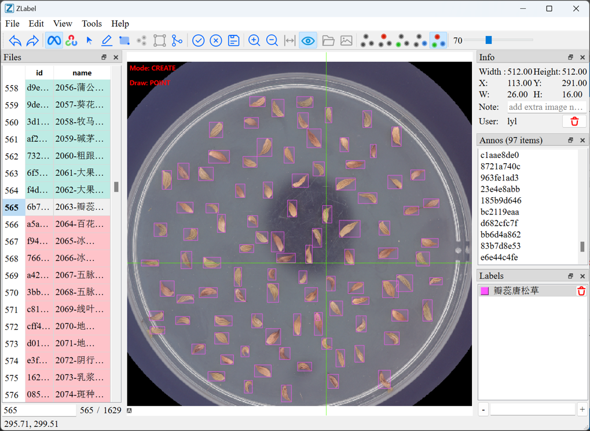

# ZLabel

ZLabel is a scientific image annotation tool designed for research workflows such as
seed-germination experiments and time-series image sequences. It combines manual
rectangle / polygon / keypoint annotation with SAM-assisted and OpenCV-assisted
segmentation, per-instance tracking across frames, and direct export to common
dataset formats (COCO / Ultralytics YOLO).



## Features

- Manual annotation: rectangles, polygons, keypoints
- AI-assisted segmentation: SAM / EdgeSAM / SlimSAM / SAM2 / SAM3 (remote or local MNN)
- OpenCV-assisted contour extraction
- Remote server mode and fully-local mode (no server required)
- Cross-frame instance tracking with an instance timeline
- Seed-germination workflow: instance grouping, per-instance status labels, copy previous frame
- Optional WeChat OCR for timestamp text
- Export to COCO JSON and Ultralytics YOLO (detection / segmentation / keypoints)
- Chinese / English UI

## Download & Install

### Windows installer

Download the latest Windows installer from the
[Releases](https://github.com/ZhengGroupLZU/ZLabel/releases) page and run it.

> **Model files are not bundled with the installer.** Local SAM inference needs
> MNN model files. They are not published yet — please contact the maintainers
> for the model package, then put the `.mnn` files into `data/models/mnn` (or the
> folder configured in **Settings → Model dir**).

### Run from source

```bash
# install dependencies (Python 3.10–3.13, uv is required)
uv sync

# launch the GUI
uv run zlabel
```

## Quick Start

1. Start ZLabel.
2. Open **Settings** and configure either:
   - **Remote mode**: server host (default `http://127.0.0.1:8000`), username, password.
   - **Local mode**: no server is needed; project data is stored under `~/.zlabel/projects/`.
3. Create or open a project, then load tasks / images.
4. Pick a label from the **Labels** panel.
5. Draw annotations:
   - `R` — rectangle
   - `P` — point / keypoint
   - `O` — polygon
6. Save with `Ctrl+S`.
7. Export with **Export** (COCO / YOLO).

## Configuration

### Server connection (remote storage + remote inference)

- **Host**: the ZL annotation server URL, e.g. `http://127.0.0.1:8000`
- **Username / password**: credentials accepted by the server
- The client talks to the server through its HTTP API (`/api/v1/...`).
  Server deployment is documented separately from this client repository.

### Local storage

A project can be stored completely locally:

- Project root: `~/.zlabel/projects/<project-name>/`
- Images: `<project>/images/` (`.png`, `.jpg`, `.jpeg`)
- Annotations: `<project>/annos/` (one `.zlabel` JSON per frame)
- Sequence layout `species/dish/D{n}.png` is auto-detected as a timeline group.

### Inference modes

| Mode | Description |
| --- | --- |
| Remote | The configured server performs SAM / OpenCV inference. |
| Local | Inference runs in-process with MNN models. |

Local inference settings:

- **Model name**: `SAM`, `EdgeSAM`, `SlimSAM`, `SAM2`, `SAM3`
- **Backend**: `AUTO`, `CPU`, `CUDA`, `Metal`, `OpenCL`
- **Model dir**: folder containing the MNN model files
- **Upload image size**: long edge used when uploading images to a remote server

### WeChat OCR (optional)

For automatic timestamp OCR on rectangle annotations:

1. Obtain the WeChat OCR engine folder (contains `WeChatOCR.exe` and the
   `mmmojo_64.dll` / UCRT DLLs).
2. Set the folder in **Settings → OCR dir**.
3. Enable manual OCR in settings if you do not want to be prompted when OCR fails.

### Other settings

- **Alpha**: fill opacity of annotations
- **Random select**: shuffle the task list
- **Catmull-Rom**: smooth polygon rendering while drawing
- **Language**: English / Chinese
- **Auto-fit dish**: automatically segment and ellipse-fit the dish when opening a frame
- **Copy previous frame**: enable copying annotations from the previous frame of a sequence

## Annotation Workflow

### Modes

| Mode | Shortcut | Purpose |
| --- | --- | --- |
| Move | `M` | Select / move annotations |
| Edit | `E` | Edit / resize / box-select annotations |
| Rectangle | `R` | Draw rectangles |
| Point | `P` | Draw points / keypoints |
| Polygon | `O` | Draw polygons |
| Merge | `G` | Merge selected shapes / group instances |
| SAM | `Q` | Toggle SAM-assisted segmentation |
| OpenCV | — | Toggle OpenCV-assisted segmentation |

### Editing

- Drag an annotation to move it; drag handles to resize.
- Drag on empty space in **Edit** mode to box-select multiple annotations.
- `Del` deletes the selection.
- `Ctrl+Z` / `Ctrl+Y` undo / redo.
- `V` toggles annotation visibility.
- The **Labels** panel has two tabs:
  - **Labels**: manage annotation labels, colors and visibility.
  - **Instance**: manage instance statuses (e.g. `Normal seed`), their visibility,
    and the default status used when merging instances.

### Keypoints

- Switch annotation type to **Point** (KeyPoint mode).
- `L` / `O` / `X` set keypoint visibility: labeled / occluded / excluded.
- `G` groups selected keypoints into one instance; `U` splits them.
- Keypoints are exported with COCO keypoint format.

### Instances & seed-germination workflow

- Each annotation carries an `instance_id`; the same number across frames denotes
  the same physical object.
- `Ctrl+G` merges selected annotations into one instance (the merged instance
  keeps the smallest existing instance id); `Ctrl+G` again splits them.
- Per-instance status labels (e.g. `Normal seed`, `Moldy seed`) are stored in
  `Annotation.instances` and shown in the **Annos** panel.
- The **Timeline** dock shows all frames of the current sequence:
  - click a cell to jump to that frame and select the instance
  - drag a cell to renumber / swap instance ids
- **Copy previous frame** copies the previous frame's dish / timestamp / instance
  parts, optionally aligning them to the current dish.

### Dish cropping

When a **Dish** annotation exists, SAM inference can crop to the dish bounding box
before prediction. This improves accuracy and speed on dish images.

### OCR

Rectangle annotations can store an OCR'ed timestamp (WeChat OCR). The text is
kept in the rectangle result and exported with the annotation.

## Export

Open **Export** and choose:

- **Format**: COCO JSON or Ultralytics YOLO
- **Task**: detection, segmentation, or keypoints
- **Instance mode** (seed workflow): split by part, or merge all parts of an
  instance into one segmentation with the instance status as category

## Shortcuts

| Action | Shortcut |
| --- | --- |
| Next image | `D` |
| Previous image | `A` |
| Save | `Ctrl+S` |
| Undo | `Ctrl+Z` |
| Redo | `Ctrl+Y` |
| Zoom in | `Ctrl++` |
| Zoom out | `Ctrl+-` |
| Fit window | `F` |
| Move | `M` |
| Edit | `E` |
| Rectangle | `R` |
| Point | `P` |
| Polygon | `O` |
| Finish polygon | `Enter` / `Space` / `Double-click` |
| Undo last polygon vertex (drawing) | `Backspace` |
| Delete hovered polygon vertex (edit) | `Backspace` |
| SAM | `Q` |
| Merge / group instances | `G` / `Ctrl+G` |
| Split keypoint instances | `U` |
| Keypoint visibility | `L` / `O` / `X` |
| Delete | `Del` |
| Toggle annotations visibility | `V` |
| Finish / submit | `Ctrl+Enter` |
| Select label 1–9 | `1` – `9` |

## Troubleshooting

| Problem | Check |
| --- | --- |
| Local inference fails to start | MNN model files are missing in the model dir |
| Remote login fails | Host / username / password, server availability |
| Images do not appear | Local storage: images must be under `<project>/images/` |
| OCR does nothing | WeChat OCR folder is not configured correctly |
| Timeline is empty | Images must follow the `species/dish/D{n}.png` sequence layout |

## Development

See [CONTRIBUTING.md](./CONTRIBUTING.md) for environment setup, module overview,
testing, and build instructions.

## License

Apache-2.0

## Citation

TODO: add citation when the paper is published.
